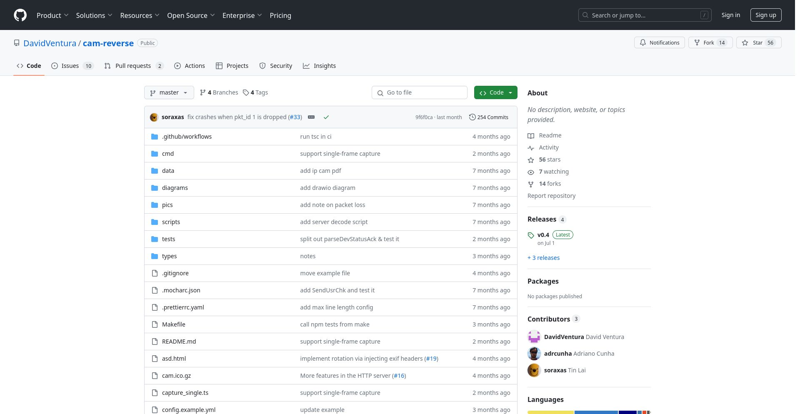
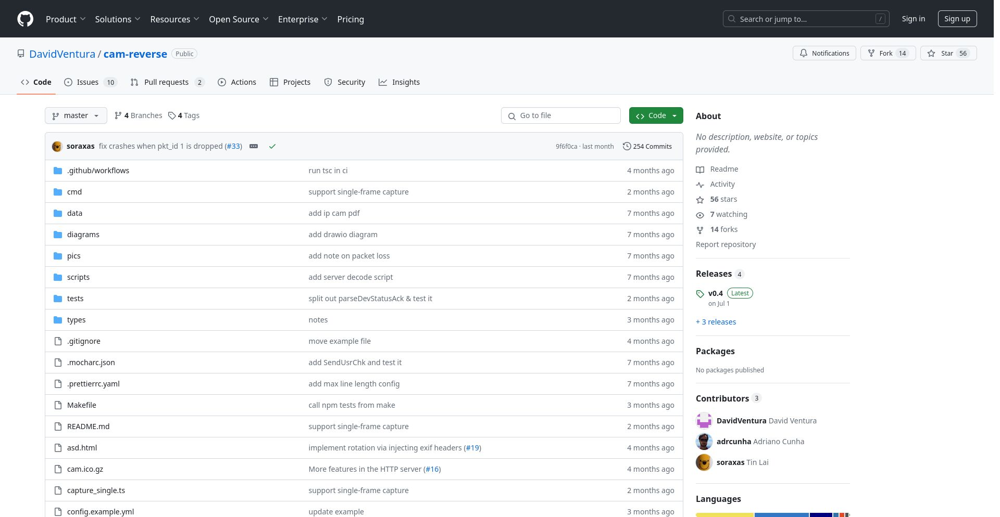
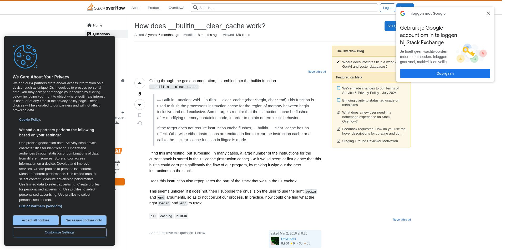
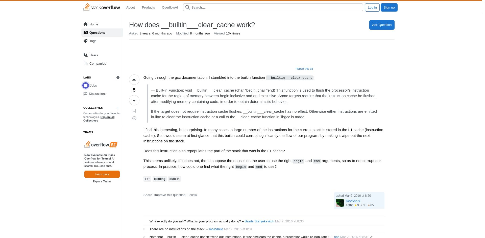

# What

This is a low-effort script to generate screenshots from custom CSS rules I have for "skinny" pages.

# Why

Skinny pages annoy me to no end. Most people use widescreens, why do lots of sites have a max-width of ~1000px???

# Example

|Before|After|
|-|-|
|||
|||

# Drivers
Get them from [selenium docs](https://selenium-python.readthedocs.io/installation.html#drivers)

I got geckodriver from [here](https://github.com/mozilla/geckodriver/releases/download/v0.35.0/geckodriver-v0.35.0-linux64.tar.gz)
and firefox itself from [here](https://download.mozilla.org/?product=firefox-latest-ssl&os=linux64&lang=en-US)

# How

Click `export` in stylus, update all the hardcoded paths, add some example URLs in `url_to_screenshot`
